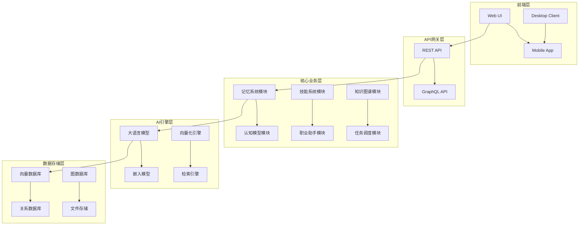

# 个人 AI 操作系统 - 架构设计文档

## 项目概述
基于记忆系统、认知模型和职业技能的个人 AI 操作系统，旨在打造一个完整的个人 AI 助手生态系统。

## 系统架构图



## 核心模块设计

### 1. 记忆系统模块 (Memory Module)
**功能**: 个人知识管理与记忆宫殿
**技术栈**: 
- 向量数据库 (Chroma/Pinecone)
- 嵌入模型 (Sentence Transformers)
- 检索增强生成 (RAG)

**接口设计**:
```typescript
interface MemoryModule {
  store(content: string, metadata: Record<string, any>): Promise<string>;
  retrieve(query: string, topK?: number): Promise<MemoryResult[]>;
  forget(memoryId: string): Promise<boolean>;
  search(tags: string[]): Promise<MemoryResult[]>;
  summarize(period: DateRange): Promise<string>;
}
```

**关键特性**:
- 长短期记忆分离
- 个性化记忆策略
- 多模态记忆支持
- 记忆关联分析

### 2. 认知模型模块 (Cognition Module)
**功能**: 心智模型蒸馏与认知推理
**技术栈**:
- 大语言模型 (Claude/OpenAI)
- Prompt Engineering
- 思维链推理 (CoT)

**接口设计**:
```typescript
interface CognitionModule {
  reason(input: string, context?: any): Promise<CognitionResult>;
  analyze(personality: PersonalityProfile): Promise<Insight[]>;
  suggest(strategy: StrategyType): Promise<Suggestion[]>;
  reflect(experience: Experience): Promise<LearningOutcome>;
}
```

**关键特性**:
- 个人认知模型训练
- 决策支持系统
- 学习反馈循环
- 认知偏差检测

### 3. 技能系统模块 (Skills Module)
**功能**: 可扩展的技能框架
**技术栈**:
- 插件化架构
- 服务发现机制
- 动态加载

**接口设计**:
```typescript
interface SkillsModule {
  register(skill: SkillDefinition): Promise<void>;
  execute(skillId: string, params: any): Promise<any>;
  list(): Promise<SkillInfo[]>;
  update(skillId: string, definition: SkillDefinition): Promise<void>;
  uninstall(skillId: string): Promise<boolean>;
}
```

**关键特性**:
- 插件化技能管理
- 技能依赖解析
- 安全沙箱执行
- 社区技能市场

### 4. 职业助手模块 (Career Module)
**功能**: 求职规划与职业发展
**技术栈**:
- 简历分析引擎
- 面试模拟系统
- 职业路径规划

**接口设计**:
```typescript
interface CareerModule {
  analyzeResume(resume: Resume): Promise<AnalysisReport>;
  generateCoverLetter(jobDescription: string): Promise<string>;
  mockInterview(questions: string[]): Promise<InterviewFeedback>;
  suggestSkills(gap: SkillGap): Promise<SkillRecommendation[]>;
}
```

**关键特性**:
- 个性化简历优化
- 面试技巧提升
- 职业路径规划
- 技能差距分析

## 数据流设计

### 用户请求处理流程
1. **输入预处理**: 自然语言解析
2. **意图识别**: 确定用户需求
3. **模块路由**: 分发到相应模块
4. **AI处理**: 执行核心逻辑
5. **结果合成**: 组织输出格式
6. **响应返回**: 返回用户界面

### 记忆流程
1. **事件捕获**: 监听用户活动
2. **信息提取**: 提取关键信息
3. **向量化**: 转换为向量表示
4. **存储索引**: 存入向量数据库
5. **关联建立**: 构建记忆连接

## 安全与隐私

### 数据加密
- 传输加密 (TLS 1.3)
- 存储加密 (AES-256)
- 密钥管理 (KMS)

### 隐私保护
- 本地处理优先
- 数据最小化原则
- 透明化控制

## 部署架构

### 微服务部署
- 容器化 (Docker)
- 服务编排 (Kubernetes)
- 负载均衡
- 自动扩缩容

### 本地部署
- 边缘计算支持
- 离线功能保障
- 同步机制

## 性能指标

### 响应时间
- API响应: <200ms
- 复杂推理: <2s
- 搜索查询: <100ms

### 可用性
- 系统可用性: 99.9%
- 数据一致性: 强一致性
- 故障恢复: <5分钟

## 扩展性考虑

### 水平扩展
- 无状态服务设计
- 数据库分片
- CDN加速

### 功能扩展
- 插件化架构
- API标准化
- 事件驱动模式